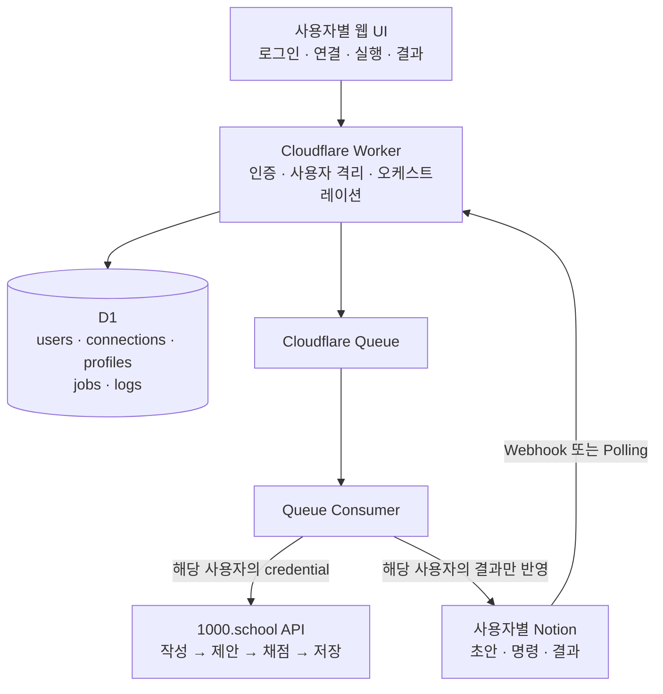

# AGENTS.md

## 1. 프로젝트 개요

이 저장소는 여러 사용자가 같은 자동화 웹앱을 사용하면서, 각자 자신의 Notion 연결과 1000.school 계정을 등록해 일일 스니펫 작업을 자동화하는 Cloudflare 기반 서비스다.

이 프로젝트에서 “여러 팀원이 사용한다”는 것은 사용자를 하나의 팀이나 그룹으로 묶어 공동 계정을 사용하는 의미가 아니다. 각 사용자는 독립된 계정으로 로그인하고 다음 연결을 본인 소유로 등록한다.

- 사용자 본인의 Notion integration token과 database
- 사용자 본인의 1000.school token 또는 허용된 session credential
- 두 연결을 묶는 사용자별 자동화 설정

한 사용자의 token, Notion 초안, 1000.school 작업, 실행 결과는 다른 사용자에게 절대 사용되거나 노출되어서는 안 된다. 시스템의 핵심 격리 단위는 `userId`다. MVP에는 `team`, `workspace`, `membership`, 팀 초대, 팀 역할 체계를 두지 않는다.

- 서비스 화면: https://app.1000.school/daily-snippets
- 1000.school API 문서: https://api.1000.school/docs#/

주요 목표는 다음과 같다.

1. 사용자가 자신의 Notion과 1000.school 연결을 안전하게 등록한다.
2. 사용자별 Notion 데이터베이스에서 게시 대상 초안을 조회한다.
3. 반드시 같은 사용자의 1000.school 계정으로 초안을 작성한다.
4. AI 제안 → AI 채점 → 저장 단계를 순서대로 실행하고 결과를 수집한다.
5. 사용자가 Notion 또는 자체 웹 UI에서 본인 작업만 실행·재실행·확인한다.
6. token, cookie, 개인 데이터가 다른 사용자, client, log 또는 Git에 노출되지 않게 한다.

## 2. 범위와 비범위

### 포함 범위

- 여러 사용자의 개별 로그인
- 사용자별 Notion 연결
- 사용자별 1000.school 연결
- 사용자별 자동화 설정과 작업 이력
- Notion 초안 조회와 결과 반영
- 작성, AI 제안, AI 채점, 저장의 단계별 실행
- 수동 실행, 재시도, 선택적 예약 실행
- 운영 관리자용 최소 장애 확인 기능

### MVP 비범위

- 사용자를 팀으로 그룹화하는 기능
- 팀 생성, 초대, 탈퇴, 소유권 이전
- `OWNER`, `ADMIN`, `MEMBER`, `VIEWER` 같은 팀 역할
- 팀 공용 Notion token 또는 공용 1000.school token
- 다른 사용자의 초안이나 실행 결과 공동 열람
- 관리자가 사용자의 평문 token 또는 전체 content를 열람하는 기능

향후 팀 기능을 추가하더라도 현재 사용자별 격리 모델 위에 별도 기능으로 설계하며, 사용자별 credential을 팀 공용 credential로 자동 전환하지 않는다.

## 3. 기술 원칙

- 런타임: Cloudflare Workers + TypeScript.
- 웹 UI는 Workers 정적 자산 또는 별도 프런트엔드를 사용할 수 있지만 비밀값은 브라우저에 다시 전달하지 않는다.
- 설정·상태 저장:
  - 시스템 공통 비밀값과 credential encryption master key: Cloudflare Secrets.
  - 사용자별 Notion/1000.school credential: master key로 인증된 암호화를 적용해 D1에 저장.
  - 사용자, 연결, 자동화 설정, 작업 상태, 멱등성 key: D1.
  - 짧은 cache: KV.
  - 정확한 직렬화나 분산 잠금: Durable Objects 또는 D1 조건부 상태 전이. KV를 잠금이나 권한 원장으로 사용하지 않는다.
  - 비동기 작업과 재시도: Cloudflare Queues.
  - 예약 실행: Cron Triggers.
- 패키지 관리자는 기존 lockfile을 따르고, 새 프로젝트라면 `pnpm`을 기본으로 한다.
- 모든 외부 요청은 timeout, 제한된 재시도, 구조화된 error, request ID를 가져야 한다.
- 공식·문서화된 API를 우선한다. 브라우저 동작 재현은 공식 API로 해결할 수 없고 서비스 약관과 사용자 권한상 허용될 때만 검토한다.

## 4. 권장 아키텍처



### 사용자 사용 모델

- `user`: 로그인한 실제 사용자. email 문자열 대신 인증 공급자의 불변 subject로 식별한다.
- `credential`: 사용자가 등록한 암호화된 Notion 또는 1000.school credential이다.
- `notion_connection`: 사용자가 연결한 Notion workspace/database와 property mapping이다.
- `thousand_school_account`: 사용자가 연결한 1000.school 계정이다.
- `automation_profile`: 같은 사용자의 Notion connection과 1000.school account를 묶은 실행 설정이다.
- `job`: 한 사용자의 한 Notion 초안을 처리하는 작업이다.
- `job_step`: 작성, AI 제안, AI 채점, 저장의 개별 단계 상태다.

사용자에게 연결이 여러 개라면 실행 전에 `automation_profile`을 명시적으로 선택한다. 시스템이 서로 다른 사용자의 연결을 후보로 검색하거나 자동 추론해서는 안 된다.

### 모듈 경계

- `src/routes/`: HTTP route와 입력 검증. business logic을 넣지 않는다.
- `src/auth/`: login session과 현재 `userId` 확정.
- `src/tenancy/`: 모든 조회와 변경에 사용자 scope를 강제.
- `src/services/notion/`: Notion 조회, block 변환, 상태 업데이트.
- `src/services/thousand-school/`: 1000.school 인증과 API adapter.
- `src/workflows/`: 작성 → AI 제안 → AI 채점 → 저장 orchestration.
- `src/repositories/`: D1 사용자, 연결, 설정, 작업, 실행 이력 접근.
- `src/security/`: credential 암복호화, CSRF, 서명 검증, 민감정보 masking.
- `src/lib/`: HTTP client, retry, logging, error type.
- `src/types/`: 외부 API DTO와 내부 domain type.
- `migrations/`: D1 migration.
- `test/`: unit, integration, contract, security test.

외부 서비스 응답은 route나 workflow에서 직접 사용하지 말고 각 service adapter에서 검증한 내부 type으로 변환한다.

## 5. 인증과 사용자 격리

시스템 공통 비밀값 예시:

- `CREDENTIAL_ENCRYPTION_KEY`
- `SESSION_SECRET`
- `WEBHOOK_SIGNING_SECRET`

`NOTION_TOKEN`, `NOTION_DATABASE_ID`, `THOUSAND_SCHOOL_TOKEN`을 모든 사용자가 공유하는 단일 환경변수로 두지 않는다. 각 사용자가 본인의 연결 화면에서 등록하고, 서버가 사용자 소유 credential로 저장한다.

### 필수 규칙

1. 로그인 identity를 내부 `users.id`에 mapping한 뒤 모든 요청에 `userId`를 주입한다.
2. client가 보낸 `userId`를 신뢰하지 않는다. 현재 login session에서만 결정한다.
3. 모든 사용자 소유 table과 repository 조회는 `user_id` 조건을 필수로 사용한다.
4. 전역 ID만으로 조회하는 `WHERE id = ?`를 금지하고 `WHERE user_id = ? AND id = ?` 형태를 사용한다.
5. `job.user_id`, `automation_profile.user_id`, `notion_connection.user_id`, `thousand_school_account.user_id`가 모두 같아야 한다.
6. Queue payload에는 token이나 cookie를 넣지 않고 `userId`, `jobId`, `profileId` 같은 불투명 ID만 넣는다.
7. Queue consumer는 처리 직전에 job, profile, connection의 소유자와 활성 상태를 다시 확인한다.
8. 권한 거부 응답은 다른 사용자 데이터의 존재 여부를 노출하지 않는다.
9. 운영 관리자도 사용자 token, cookie, Notion 원문 전체를 조회할 수 없다.
10. 계정 비활성화나 연결 해제 시 신규 실행을 즉시 막고 보류 작업을 `CANCELLED`로 전환한다.

## 6. Credential과 보안 규칙

1. 실제 token, session cookie, API key를 code, fixture, README, log, error message에 쓰지 않는다.
2. `.dev.vars`, `.env*`, Wrangler local state를 Git에서 제외한다. `.env.example`에는 변수 이름과 설명만 둔다.
3. credential을 client bundle, HTML, localStorage, URL query string에 저장하지 않는다.
4. token 입력은 TLS로 Worker에 전달하고, Worker가 즉시 암호화한 뒤 평문 참조를 폐기한다.
5. D1 credential은 AES-GCM 등 인증된 암호화로 보호하고 `key_version`, `iv`, `ciphertext`, `auth_tag` 또는 동등한 정보를 저장한다.
6. encryption master key는 D1에 저장하지 않는다.
7. token을 저장한 뒤 전체 값을 UI에 다시 표시하지 않는다. 연결 상태와 일부 masking 정보만 제공한다.
8. log에는 `Authorization`, `Cookie`, Notion 원문, 개인식별정보를 남기지 않는다.
9. 사용자가 본인에게 발급되고 본인 계정에 사용할 권한이 있는 credential만 등록하도록 명시한다.
10. CAPTCHA, MFA, bot 방지, 접근통제, rate limit을 우회하지 않는다.
11. token 만료 또는 401/403 발생 시 무한 재로그인하지 않고 해당 사용자의 연결을 `AUTH_REQUIRED`로 전환한다.
12. 한 사용자의 인증 실패가 다른 사용자의 연결이나 작업을 중단시키지 않게 한다.

## 7. 도메인 모델

최소 D1 table:

- `users(id, auth_subject, email, display_name, status, created_at, updated_at)`
- `credentials(id, user_id, kind, key_version, encrypted_payload, status, expires_at, created_at, updated_at)`
- `notion_connections(id, user_id, credential_id, workspace_ref, database_id, property_mapping_json, status, created_at, updated_at)`
- `thousand_school_accounts(id, user_id, credential_id, provider_account_ref, status, expires_at, created_at, updated_at)`
- `automation_profiles(id, user_id, name, notion_connection_id, thousand_school_account_id, default_mode, schedule_json, enabled, created_at, updated_at)`
- `jobs(id, user_id, profile_id, notion_page_id, target_date, mode, status, content_hash, remote_record_id, created_at, updated_at)`
- `job_steps(id, user_id, job_id, stage, status, attempt_count, output_ref, safe_error_code, started_at, finished_at)`
- `audit_logs(id, user_id, actor_user_id, action, target_type, target_id, metadata_json, created_at)`

외래키, 사용자 scope unique constraint, index를 migration에 명시한다. 특히 profile 생성 시 두 connection의 `user_id`가 profile 소유자와 같은지 transaction 안에서 검증한다.

최소 작업 상태:

- `PENDING`: 실행 대기.
- `FETCHED`: Notion 원문 조회 완료.
- `DRAFT_CREATED`: 1000.school 초안 작성 완료.
- `AI_SUGGESTED`: AI 제안 완료.
- `AI_SCORED`: AI 채점 완료.
- `SAVED`: 최종 저장 완료.
- `FAILED_RETRYABLE`: 재시도 가능한 실패.
- `FAILED_FINAL`: 사용자 조치가 필요한 실패.
- `AUTH_REQUIRED`: 사용자의 인증 갱신 필요.
- `PROFILE_REQUIRED`: 사용할 사용자별 automation profile이 없음.
- `CANCELLED`: 사용자 비활성화, 연결 해제 또는 사용자 취소로 중단.

각 job은 최소한 다음 정보를 가진다.

- job ID와 소유 `userId`
- automation profile ID
- Notion page ID와 target date
- 원문 수정 시각 또는 content hash
- 1000.school remote record ID
- 실행 mode와 현재 stage
- 단계별 완료 시각
- 시도 횟수와 다음 재시도 시각
- 민감정보를 제거한 마지막 error code/message
- 생성·수정 시각

멱등성 key는 기본적으로 `userId + profileId + notionPageId + targetDate + contentHash + mode`로 만든다. 동일 key가 목표 단계까지 완료되었으면 외부 요청을 반복하지 않는다.

실행 mode는 `DRAFT_ONLY`, `SUGGEST`, `SCORE`, `SAVE`, `FULL_AUTO`를 지원한다. MVP 기본값은 최종 저장 전에 사용자 확인이 있는 mode로 한다.

## 8. Notion 연동 규칙

- 각 사용자는 자신의 Notion token과 database ID를 등록한다.
- Notion 공식 API와 공식 SDK 또는 표준 `fetch`를 사용한다.
- database property 이름은 사용자별 `notion_connection.property_mapping_json`으로 관리한다.
- 권장 property:
  - `제목`: title
  - `날짜`: date
  - `상태`: select (`초안`, `전송대기`, `처리중`, `완료`, `오류`)
  - `1000school ID`: rich text
  - `AI 제안`: rich text 또는 page content
  - `AI 점수`: number
  - `마지막 오류`: rich text
- pagination을 항상 처리한다.
- block 순서를 보존해 plain text 또는 대상 형식으로 변환한다.
- 지원하지 않는 block은 조용히 버리지 말고 placeholder 또는 warning을 남긴다.
- 1000.school 단계가 성공한 뒤에만 해당 사용자의 Notion page에 결과를 반영한다.
- webhook을 사용하면 서명을 검증하고 중복 event를 멱등하게 처리한다.
- webhook route는 source/connection ID로 소유 사용자를 결정한다. payload가 임의의 `userId`를 지정하게 하지 않는다.
- 한 사용자의 webhook event가 다른 사용자의 profile이나 job을 시작할 수 없어야 한다.
- webhook이 적합하지 않으면 사용자별 Cron polling을 사용하되 비활성 profile은 조회하지 않는다.

## 9. 1000.school 연동 규칙

공식 API 문서인 https://api.1000.school/docs#/ 를 연동 계약의 우선 근거로 사용한다. 구현 전에 인증 방식, endpoint, request/response schema, error code, rate limit을 확인하고 contract fixture에 반영한다. 문서와 실제 응답이 다르면 임의로 우회하지 말고 차이를 기록한 뒤 사용자 확인을 요청한다.

`src/services/thousand-school/` 아래에 다음 interface를 제공한다.

```ts
export interface ThousandSchoolClient {
  createOrUpdateDraft(input: DailySnippetInput): Promise<DraftResult>;
  requestAiSuggestion(draftId: string): Promise<AiSuggestionResult>;
  requestAiScore(draftId: string): Promise<AiScoreResult>;
  save(draftId: string): Promise<SaveResult>;
  getDraft?(draftId: string): Promise<DraftResult>;
}
```

Client는 job 소유자와 같은 `userId`의 `thousandSchoolAccountId`로 생성한다. 전역 singleton client에 특정 사용자의 token을 보관하지 않는다.

- endpoint, method, header, payload, response schema를 추측하지 않는다.
- 공식 API 문서를 우선하고, 문서에 없는 동작만 사용자가 직접 확인한 합법적 요청을 근거로 검토한다.
- UI button 이름이 아니라 실제 허용된 API 동작을 adapter method로 표현한다.
- 필요한 최소 cookie와 header만 사용하고 브라우저 전체 cookie를 저장하지 않는다.
- CSRF token이 필요하면 정상 login 흐름에서 발급된 값을 사용하고 만료를 처리한다.
- browser automation은 API 방식이 불가능하고 서비스 약관과 사용자 권한상 허용될 때만 별도 승인 아래 도입한다.
- 작성 → AI 제안 → AI 채점 → 저장은 앞 단계의 성공과 identifier를 검증한 뒤 순차 실행한다.
- 저장 전에 AI 제안과 점수가 현재 draft/content hash에 해당하는지 확인한다.

## 10. 워크플로 규칙

기본 순서:

1. login session에서 `userId` 확정
2. 입력 schema와 automation profile 소유권 검증
3. profile의 Notion connection과 1000.school account가 모두 같은 사용자 소유인지 검증
4. `userId + profileId + notionPageId` 기준 잠금 또는 원자적 상태 전이
5. Queue에 식별자만 enqueue
6. Queue consumer에서 사용자, profile, connection, credential 상태 재검증
7. 해당 사용자의 Notion page와 content hash 조회
8. 해당 사용자의 1000.school 계정으로 초안 작성 또는 수정
9. 요청 mode에 따라 AI 제안 → AI 채점 → 저장 실행
10. 사용자 scope job history와 audit log 기록
11. 해당 사용자의 Notion에 상태와 결과 반영

Cloudflare Queue는 at-least-once 전달임을 전제로 한다. 모든 단계는 재실행되어도 성공한 외부 효과를 중복 생성하지 않아야 한다.

network timeout 뒤 결과가 불명확하면 같은 POST를 즉시 반복하지 않고 조회 API로 성공 여부를 확인한다. 확인 방법이 없다면 `FAILED_FINAL`로 두고 사용자 확인을 요구한다.

job 생성 뒤 Notion 내용이 바뀌면 기존 AI 제안·점수의 content hash/version을 비교한다. 다르면 stale 결과로 표시하고 AI 제안 단계부터 다시 실행하기 전에는 저장하지 않는다.

재시도는 429, 일시적 5xx, network error에만 제한적으로 적용한다. `Retry-After`, exponential backoff, jitter를 사용한다. 400, 401, 403, schema mismatch는 자동 재시도하지 않는다.

## 11. HTTP API 제안

- `GET /api/me`: 현재 사용자와 연결 상태 조회.
- `GET|PUT|DELETE /api/me/connections/notion`: 본인 Notion 연결 관리.
- `GET|PUT|DELETE /api/me/connections/thousand-school`: 본인 1000.school 연결 관리.
- `GET|POST /api/me/automation-profiles`: 본인 profile 조회·생성.
- `GET|PUT|DELETE /api/me/automation-profiles/:id`: 본인 profile 관리.
- `POST /api/jobs`: 본인 profile과 Notion page/date/mode로 job 생성.
- `GET /api/jobs`: 본인 job 목록 조회.
- `GET /api/jobs/:id`: 본인 job 상태와 단계별 결과 조회.
- `POST /api/jobs/:id/retry`: 본인의 실패 job을 실패 단계부터 재시도.
- `POST /api/jobs/:id/cancel`: 본인의 대기 또는 실행 job 취소 요청.
- `POST /api/sync/notion`: 본인의 활성 profile에서 전송 대기 page 검색 및 enqueue.
- `POST /api/webhooks/notion/:connectionId`: 서명 검증된 Notion event 수신.
- `GET /api/health`: 비밀값을 노출하지 않는 상태 점검.

모든 사용자 API는 인증, 사용자 scope, rate limit, JSON schema 검증을 적용한다. 단건 job API도 URL ID만 믿지 않고 `job.user_id`를 login 사용자와 대조한다. 내부 stack trace를 응답에 반환하지 않는다.

## 12. 자체 웹 UI 요구사항

- login 사용자의 연결 상태, automation profile, job 목록과 단계별 상태를 보여준다.
- Notion token/database와 1000.school token을 각각 본인이 등록·갱신·해제할 수 있게 한다.
- token 저장 후 전체 값을 다시 보여주지 않는다.
- 다른 사용자를 검색하거나 다른 사용자의 connection·job을 보는 UI를 만들지 않는다.
- `동기화`, `AI 제안`, `AI 채점`, `저장`, `실패 단계 재시도`를 제공할 수 있다.
- 실행 중 button을 비활성화하되 서버에서도 중복 실행을 검증한다.
- 최종 저장 전 preview와 명시적 확인을 제공한다. `FULL_AUTO`는 사용자별 별도 설정으로 켠다.
- 안전하게 축약한 오류, 인증 갱신 필요 상태, 마지막 성공 시각을 표시한다.
- 성공 toast만 믿지 않고 server job 상태를 다시 조회한다.

운영자 화면이 필요하면 사용자 ID, 연결 상태, error code, job stage 등 최소 정보만 제공한다. 평문 token, cookie, Notion 원문, AI 결과 전체는 노출하지 않는다.

## 13. 코딩 규칙

- TypeScript strict mode를 유지한다.
- `any` 대신 `unknown`과 runtime schema validation을 사용한다.
- 외부 입력과 응답은 Zod 등으로 검증한다.
- 함수는 하나의 책임을 갖고 외부 효과를 domain logic과 분리한다.
- 날짜는 내부적으로 ISO 8601 UTC를 사용하고 표시와 target date 계산에는 `Asia/Seoul`을 명시한다.
- 오류는 `code`, `retryable`, `stage`, `safeMessage`, `cause`를 가진 typed error로 정규화한다.
- log는 JSON으로 남기고 `requestId`, 불투명 `userId`, `jobId`, `stage`, `durationMs`, `status`를 포함한다.
- email, Notion 원문, token, cookie, 인증 header를 log에 넣지 않는다.
- 새 dependency는 Workers compatibility, bundle size, 유지보수 상태를 확인한 뒤 추가한다.
- Node 전용 API에 의존하지 않는다. 필요하면 Workers 호환 설정과 이유를 문서화한다.
- 기존 code style, lint, formatter, test command를 우선한다.

## 14. 테스트 요구사항

최소 테스트 범위:

- Notion block → daily snippet text 변환.
- property 누락, 빈 초안, 긴 content, 한글, emoji, line break 처리.
- 1000.school request/response contract. 실제 token 대신 sanitized fixture 사용.
- 각 workflow 단계 성공과 중간 실패 후 재개.
- 같은 멱등성 key의 동시 요청과 중복 click.
- 서로 다른 사용자가 같은 Notion page ID 또는 같은 date를 사용해도 충돌하지 않음.
- 사용자 A가 사용자 B의 connection, profile, job, result를 조회·변경할 수 없음.
- ID를 바꾼 IDOR 시도에 다른 사용자 데이터 존재 여부가 노출되지 않음.
- 사용자 A의 job이 사용자 B의 Notion 또는 1000.school credential을 선택하지 않음.
- enqueue 이후 사용자가 connection을 해제하면 외부 API 호출 전에 중단됨.
- 401/403, 429, 5xx, timeout, malformed JSON 처리.
- log, response, DB error field에 token과 cookie가 남지 않음.
- 저장 전에 AI 제안/점수가 현재 content와 일치함.
- 한국 자정 경계와 사용자별 예약 실행.

외부 서비스에 쓰기 작업을 하는 test는 기본 suite에서 실행하지 않는다. 별도의 opt-in E2E 환경과 사용자별 test account를 사용하며 최종 저장 전까지 dry-run을 기본값으로 한다.

## 15. 개발 및 구현 순서

권장 검증 명령:

```bash
pnpm install
pnpm lint
pnpm typecheck
pnpm test
pnpm dev
pnpm deploy
```

구현 순서:

1. Workers TypeScript project와 환경 type 정의.
2. 사용자 인증과 `users` table.
3. 사용자 scope repository와 교차 사용자 접근 방지 middleware.
4. 사용자별 credential 암호화, 갱신, 폐기.
5. Notion connection, 1000.school account, automation profile schema.
6. Notion 읽기/변환 adapter와 fixture test.
7. https://api.1000.school/docs#/ 기준 API contract 조사와 문서화.
8. job/job_steps 상태 machine과 Queue consumer.
9. mock `ThousandSchoolClient` 기반 사용자별 workflow test.
10. 실제 adapter 연결과 dry-run.
11. 사용자 연결·profile·job 관리 웹 UI.
12. 두 명 이상의 사용자와 서로 다른 token을 사용한 교차 접근 방지 E2E.
13. 제한적 production 활성화.

1000.school 실제 계약이 확인되기 전에는 endpoint나 payload를 가정하지 않는다. 그 전에는 interface, mock, 상태 machine까지만 완성한다.

에이전트는 변경 후 최소한 lint, typecheck, 관련 test를 실행한다. 실행하지 못한 검증은 이유와 함께 보고한다. 실제 배포, 실제 계정 저장, 비밀값 변경은 사용자의 명시적 요청 없이 수행하지 않는다.

## 16. 완료 기준

기능이 완료되었다고 보고하려면 다음 조건을 충족해야 한다.

- 두 명 이상의 사용자가 각자 다른 Notion token과 1000.school token을 연결할 수 있다.
- 각 사용자는 본인의 connection, profile, job, result만 조회·변경할 수 있다.
- 한 사용자의 job에 다른 사용자의 credential이 사용되지 않는다.
- Notion의 `전송대기` 초안을 같은 사용자의 1000.school 계정으로 전송한다.
- 하나의 job이 작성 → AI 제안 → AI 채점 → 저장 단계를 추적한다.
- 중복 실행으로 같은 글이나 AI 요청이 중복 생성되지 않는다.
- 실패 단계부터 안전하게 재개할 수 있다.
- 인증 만료가 해당 사용자에게만 `AUTH_REQUIRED`로 표시된다.
- 연결 해제나 사용자 비활성화가 Queue 처리 전에 다시 검증된다.
- 비밀값이 Git, UI, log, error response에 노출되지 않는다.
- 두 사용자·두 token을 사용한 교차 접근 방지 E2E가 통과한다.
- 배포 방법, 사용자별 token 등록 방법, Notion property mapping, 알려진 제약을 README에 기록한다.

## 17. 에이전트 작업 보고 형식

작업 완료 시 다음만 간결하게 보고한다.

1. 변경한 기능과 파일
2. 선택한 설계와 중요한 보안 판단
3. 실행한 검증과 결과
4. 남은 위험, 확인이 필요한 API 계약, 수동 설정

token 값, 전체 cookie, 민감한 request/response body는 보고에 포함하지 않는다.
