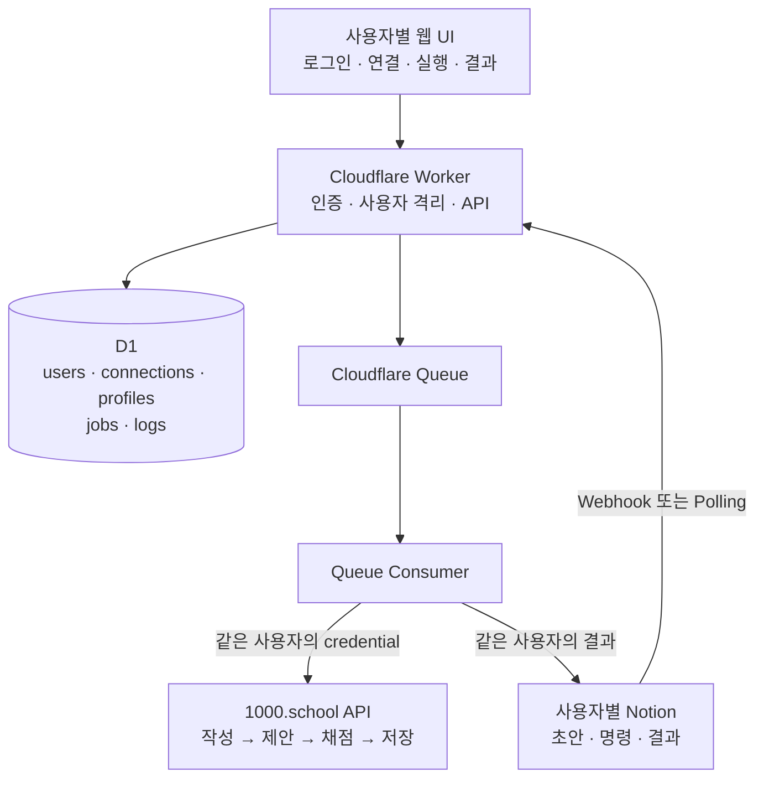

# Roadmap.md

## 1. 목적

이 로드맵은 여러 사용자가 같은 자동화 웹앱에 로그인하되, 각자 자신의 Notion token과 1000.school token을 연결해 **작성 → AI 제안 → AI 채점 → 저장** 과정을 실행하는 Cloudflare 기반 서비스의 구현 순서와 단계별 완료 기준을 정의한다.

사용자를 팀이나 그룹으로 묶는 기능은 MVP 범위가 아니다. 모든 연결, 자동화 설정, 작업과 결과는 로그인 사용자의 `userId`를 기준으로 격리한다.

참고 자료:

- 서비스 화면: https://app.1000.school/daily-snippets
- 1000.school API 문서: https://api.1000.school/docs#/
- 프로젝트 원칙과 보안 기준: `AGENTS.md`

## 2. 개발 원칙

- 첫 목표는 두 명 이상의 사용자가 서로 다른 token으로 안전하게 사용할 수 있는 MVP다.
- 팀 기능보다 사용자별 credential 분리와 교차 사용자 접근 방지를 먼저 완성한다.
- client가 보낸 `userId`를 신뢰하지 않고 login session에서 결정한다.
- 모든 사용자 소유 data는 `user_id` 조건으로 조회한다.
- 1000.school의 endpoint, payload, 인증 방식을 추측하지 않고 공식 API 문서를 우선한다.
- 실제 쓰기 작업은 mock → dry-run → 사용자별 test account → 제한적 운영 순서로 활성화한다.
- 각 phase는 완료 조건을 통과한 뒤 다음 phase로 진행한다.

## 3. 목표 아키텍처

핵심 data 흐름:

1. login session에서 내부 `userId`를 확정한다.
2. 사용자가 본인의 Notion과 1000.school credential을 등록한다.
3. 같은 사용자의 두 연결을 `automation_profile`로 묶는다.
4. profile을 선택해 job을 생성하고 Queue에는 ID만 전달한다.
5. Queue consumer가 사용자 소유권과 연결 상태를 다시 검증한다.
6. 해당 사용자의 token으로만 외부 API를 호출한다.

## 4. 단계별 로드맵

### Phase 0. API 계약과 사용자 흐름 확정

목표: 구현 전에 외부 API 계약과 사용자별 연결 흐름을 확정한다.

주요 작업:

- https://api.1000.school/docs#/ 에서 인증 방식과 daily snippets 관련 endpoint를 조사한다.
- 작성, AI 제안, AI 채점, 저장 단계의 요청 순서와 identifier를 정리한다.
- response schema, error code, rate limit, timeout, 재시도 가능 여부를 기록한다.
- 공식 API가 제공하지 않는 UI 동작을 분리한다.
- Notion database의 실제 property 이름과 type을 확정한다.
- 사용자 가입 → Notion 연결 → 1000.school 연결 → profile 생성 → 실행 흐름을 정의한다.
- MVP 기본 mode를 정한다. 최종 저장 전 사용자 확인이 있는 `DRAFT_ONLY` 또는 `SUGGEST`를 우선한다.

산출물:

- `docs/1000-school-api-contract.md`
- `docs/notion-schema.md`
- `docs/user-flow.md`
- 민감정보를 제거한 request/response fixture
- MVP 포함·제외 범위

완료 조건:

- API path, 인증 header, 필수 payload를 추측하지 않고 설명할 수 있다.
- 문서화되지 않은 동작과 추가 확인 항목이 분리되어 있다.
- 실제 저장 없이 mock contract test를 작성할 수 있다.
- 팀 생성이나 공용 token 없이 사용자별 연결 흐름이 정의되어 있다.

### Phase 1. 프로젝트 기반 구성

목표: Cloudflare Workers에서 개발·검증할 수 있는 기본 구조를 만든다.

주요 작업:

- TypeScript strict mode의 Workers project를 구성한다.
- Wrangler 환경과 D1, Queue, 선택적 KV/Durable Objects binding을 정의한다.
- `src/routes`, `src/auth`, `src/tenancy`, `src/services`, `src/workflows`, `src/repositories`, `src/security` 구조를 만든다.
- Zod 기반 validation, typed error, JSON log, request ID를 구현한다.
- lint, typecheck, unit test, local dev script를 구성한다.
- `.dev.vars`, `.env*`, Wrangler local state가 Git에 포함되지 않게 한다.

산출물:

- 실행 가능한 Worker 기본 project
- `GET /api/health`
- CI에서 실행할 lint, typecheck, test command

완료 조건:

- local Worker와 health check가 정상 동작한다.
- lint, typecheck, 기본 test가 통과한다.
- 비밀값이 저장소나 client bundle에 포함되지 않는다.

### Phase 2. 사용자 인증과 격리

목표: 모든 요청과 data 접근을 login 사용자의 `userId`로 제한한다.

주요 작업:

- `users` D1 migration을 작성한다.
- Cloudflare Access 또는 선택한 인증 공급자의 불변 subject를 내부 user와 연결한다.
- login session에서만 `userId`를 결정하는 auth middleware를 구현한다.
- repository가 `WHERE user_id = ? AND id = ?` 형태를 사용하도록 한다.
- 다른 사용자의 ID를 넣어도 존재 여부가 노출되지 않게 404/권한 응답 정책을 정한다.
- 사용자 비활성화와 session 만료를 처리한다.
- 최소 audit log 구조를 추가한다.

산출물:

- 사용자 인증 API
- user-scoped repository
- IDOR와 교차 사용자 접근 방지 test

완료 조건:

- client가 임의의 `userId`를 보내도 다른 사용자로 실행되지 않는다.
- 사용자 A가 사용자 B의 record를 조회·수정할 수 없다.
- 비활성 사용자는 신규 job과 connection을 만들 수 없다.

### Phase 3. 사용자별 Credential과 Automation Profile

목표: 각 사용자가 본인의 Notion과 1000.school 연결을 안전하게 저장하고 묶을 수 있게 한다.

주요 작업:

- `credentials`, `notion_connections`, `thousand_school_accounts`, `automation_profiles` migration을 작성한다.
- `CREDENTIAL_ENCRYPTION_KEY`를 이용한 AES-GCM 기반 암복호화를 구현한다.
- key version을 저장해 향후 rotation이 가능하게 한다.
- 사용자가 본인의 Notion token/database를 등록·갱신·해제할 수 있게 한다.
- 사용자가 본인의 1000.school token 또는 허용된 credential을 등록·갱신·해제할 수 있게 한다.
- 같은 `user_id`의 Notion connection과 1000.school account만 profile로 결합한다.
- profile이 없으면 `PROFILE_REQUIRED`를 반환한다.
- Queue payload에 token과 cookie가 들어가지 않게 한다.

산출물:

- `/api/me/connections/*` API
- `/api/me/automation-profiles` API
- credential 암복호화 test
- connection 소유권과 profile 조합 test

완료 조건:

- D1, log, error response에서 평문 token을 찾을 수 없다.
- 사용자 A의 connection으로 사용자 B의 profile을 만들 수 없다.
- connection 해제 후 관련 profile과 보류 job이 외부 API를 호출하지 않는다.
- 저장한 token 전체 값을 UI나 API가 다시 반환하지 않는다.

### Phase 4. Notion 연동

목표: 각 사용자의 Notion database에서 전송 대상 초안을 읽고 같은 사용자의 작업으로 만든다.

주요 작업:

- Notion 공식 API 기반 adapter를 구현한다.
- pagination, rate limit, timeout을 처리한다.
- block 순서를 보존해 daily snippet input으로 변환한다.
- 사용자별 `property_mapping_json`을 지원한다.
- `작성중`, `작성완료`, `처리중`, `완료`, `오류` 상태 전이를 구현한다.
- webhook 서명 검증 또는 사용자별 Cron polling을 구현한다.
- webhook connection ID로 소유 `userId`를 결정하고 payload의 임의 user 지정은 거부한다.
- 변환 결과의 content hash를 생성한다.

산출물:

- Notion 조회·변환·상태 업데이트 service
- 한글, emoji, line break, 긴 content fixture
- webhook 중복 event test

완료 조건:

- `작성완료` page가 해당 Notion connection 소유자의 job으로 생성된다.
- 사용자 A의 webhook이 사용자 B의 profile이나 job을 실행하지 않는다.
- 같은 webhook을 반복 수신해도 job이 중복 생성되지 않는다.
- 지원하지 않는 block이 조용히 누락되지 않는다.

### Phase 5. Job 상태 머신과 Queue

목표: 작성부터 저장까지의 단계를 추적하고 실패 지점부터 안전하게 재개한다.

주요 작업:

- `jobs`, `job_steps`, `audit_logs` migration을 작성한다.
- `PENDING`부터 `SAVED`까지 상태 전이를 구현한다.
- `DRAFT_ONLY`, `SUGGEST`, `SCORE`, `SAVE`, `FULL_AUTO` mode를 구현한다.
- `userId + profileId + notionPageId + targetDate + contentHash + mode` 멱등성 key를 적용한다.
- D1 조건부 전이 또는 Durable Object로 동시 실행을 제어한다.
- Queue consumer가 user, profile, connection, credential 상태를 처리 직전에 재검증한다.
- 429, 일시적 5xx, network error에만 제한적 retry를 적용한다.
- timeout 뒤 결과가 불명확하면 조회로 확인하고, 확인할 수 없으면 `FAILED_FINAL`로 전환한다.

산출물:

- job 생성·조회·취소·재시도 API
- 단계별 상태 machine test
- Queue 중복 전달과 동시 실행 test

완료 조건:

- 동일 job이 중복 enqueue되어도 외부 효과가 한 번만 발생한다.
- 중간 실패 후 성공한 단계를 반복하지 않고 재개한다.
- enqueue 이후 connection 해제나 사용자 비활성화가 발생하면 외부 호출 전에 중단된다.
- 사용자 A의 Queue message가 사용자 B의 credential을 선택하지 않는다.

### Phase 6. 1000.school Adapter

목표: 공식 API 계약에 따라 같은 사용자의 1000.school 계정으로 단계별 작업을 실행한다.

주요 작업:

- `ThousandSchoolClient` interface와 mock 구현을 완성한다.
- 공식 API 문서에 맞춰 실제 adapter를 구현한다.
- job 소유자와 같은 `userId`의 account로 client를 생성한다.
- 작성/수정, AI 제안, AI 채점, 저장을 순차 호출한다.
- 외부 response를 Zod로 검증하고 내부 domain type으로 변환한다.
- 401/403을 해당 사용자의 `AUTH_REQUIRED`로 변환한다.
- AI 제안과 점수가 현재 content hash/version에 해당하는지 검증한다.
- 문서화되지 않은 endpoint나 browser automation은 별도 승인 없이는 구현하지 않는다.

산출물:

- mock 및 실제 `ThousandSchoolClient`
- API contract test
- 사용자별 dry-run 결과

완료 조건:

- mock 환경에서 전체 workflow가 통과한다.
- 서로 다른 두 test account에서 최종 저장 직전까지 dry-run이 성공한다.
- 사용자 A의 인증 실패가 사용자 B의 연결이나 job 상태에 영향을 주지 않는다.
- 잘못된 response, 인증 만료, rate limit이 정의된 상태로 변환된다.

### Phase 7. 사용자 웹 UI

목표: 각 사용자가 본인의 연결과 작업만 관리할 수 있는 화면을 제공한다.

주요 작업:

- 로그인 사용자 정보와 연결 상태 화면을 구현한다.
- 본인 Notion 및 1000.school 연결 등록·갱신·해제 화면을 구현한다.
- automation profile 생성·수정·비활성화 화면을 구현한다.
- 본인 job 목록, 단계별 상태, 안전한 error message, 재시도 button을 구현한다.
- 최종 저장 전 preview와 확인 과정을 제공한다.
- 실행 중 중복 click을 막되 server에서도 중복 실행을 검증한다.
- 저장된 token 전체 값을 누구에게도 다시 표시하지 않는다.
- 다른 사용자를 검색하거나 다른 사용자의 connection/job을 보는 UI를 만들지 않는다.

산출물:

- 사용자 연결 및 profile 관리 화면
- job 목록·상세·재시도 화면
- 반응형 기본 UI

완료 조건:

- 로그인 사용자는 본인의 connection, profile, job만 볼 수 있다.
- 사용자가 인증 갱신 필요와 job 실패 원인을 확인할 수 있다.
- `FULL_AUTO`는 사용자별 별도 설정과 명시적 동의 없이는 활성화되지 않는다.
- 브라우저 저장소에 token이 남지 않는다.

### Phase 8. 교차 사용자 E2E와 제한적 출시

목표: 실제 운영 전에 사용자별 token 격리와 외부 효과를 검증한다.

주요 작업:

- 두 명 이상의 test user를 만들고 각자 별도의 Notion 및 1000.school test account를 연결한다.
- 각 사용자에 대해 Notion → Queue → 1000.school → Notion 전체 흐름을 검증한다.
- user ID, connection ID, profile ID, job ID를 바꾼 IDOR 공격을 점검한다.
- token 노출과 log masking을 점검한다.
- 같은 Notion page ID 또는 같은 date를 서로 다른 사용자가 사용해도 충돌하지 않는지 검증한다.
- 한국 시간 자정 경계와 사용자별 schedule을 검증한다.
- Queue 중복 전달, Worker 재시작, API timeout, 부분 성공을 test한다.
- 운영 alert, 최소 audit log, 장애 대응 절차를 작성한다.
- 처음에는 `DRAFT_ONLY` 또는 `SUGGEST`로 제한 출시한 뒤 저장 기능을 단계적으로 연다.

산출물:

- 두 사용자·서로 다른 token 기반 E2E 결과
- 배포·rollback·장애 대응 문서
- 운영 checklist

완료 조건:

- 사용자 간 data와 credential 혼선이 발생하지 않는다.
- 사용자 A의 외부 요청에 사용자 B의 token이 사용되지 않는다.
- 중복 실행과 부분 실패에서 안전하게 복구된다.
- 비밀값이 Git, UI, log, error response에 노출되지 않는다.
- 제한된 실제 account에서 명시적 승인 아래 전체 흐름이 성공한다.

## 5. MVP 범위

### 포함

- 여러 사용자의 개별 로그인
- 사용자별 Notion token/database 연결
- 사용자별 1000.school token/account 연결
- 같은 사용자의 두 연결을 묶는 automation profile
- 사용자별 Notion 초안 조회와 daily snippet 변환
- Queue 기반 비동기 실행과 job 상태 추적
- `DRAFT_ONLY`, `SUGGEST`, `SCORE`, `SAVE` 수동 단계 실행
- 실패 단계 재시도와 Notion 결과 반영
- 사용자 연결·profile·job 관리 웹 UI
- 두 사용자·서로 다른 token의 교차 접근 방지

### 제외

- team/workspace 생성
- 팀원 초대, 탈퇴, 소유권 이전
- `OWNER`, `ADMIN`, `MEMBER`, `VIEWER` 역할
- 팀 공용 Notion token 또는 1000.school token
- 다른 사용자의 초안이나 결과 공동 열람
- 조직 단위 SSO와 SCIM
- 자동 계정 복구나 로그인 자동화
- 문서화되지 않은 browser automation

## 6. 마일스톤 요약

| 마일스톤 | 포함 단계 | 결과 |
| --- | --- | --- |
| M0 계약 확정 | Phase 0 | API와 사용자별 연결 흐름 확정 |
| M1 안전한 기반 | Phase 1~3 | 인증, 사용자 격리, credential, profile 완성 |
| M2 자동화 Core | Phase 4~6 | 사용자별 Notion에서 1000.school까지 dry-run 성공 |
| M3 사용자 경험 | Phase 7 | 각 사용자가 본인 연결·실행·결과를 관리 |
| M4 제한 출시 | Phase 8 | 두 사용자·서로 다른 token의 E2E 검증 완료 |

## 7. 출시 차단 조건

다음 중 하나라도 충족되지 않으면 실제 저장 기능을 운영 환경에 활성화하지 않는다.

- 1000.school 인증 방식과 저장 endpoint가 공식 문서 또는 승인된 계약으로 확인되지 않음
- 사용자별 credential 암호화와 key 관리가 구현되지 않음
- 모든 사용자 소유 조회에 `user_id` 조건이 적용되지 않음
- job, profile, Notion connection, 1000.school account의 소유자 일치 검사가 없음
- Queue consumer가 실행 직전에 사용자와 connection 상태를 재검증하지 않음
- Queue 중복 전달에 대한 멱등성 test가 실패함
- AI 제안/점수와 현재 content hash 불일치 검사가 없음
- 401/403에서 자동 재로그인이나 반복 호출이 발생함
- log, error, UI 중 하나라도 token 또는 전체 cookie를 노출함
- 두 사용자·서로 다른 token으로 교차 사용자 E2E를 통과하지 못함

## 8. 초기 작업 백로그

1. 1000.school API 문서에서 daily snippets 관련 endpoint 목록 작성
2. Notion database property와 sample page 확정
3. Workers TypeScript project 초기화
4. `users` migration과 login session 구현
5. user-scoped repository와 IDOR test 작성
6. credential encryption module과 test 작성
7. Notion connection, 1000.school account schema 작성
8. automation profile 생성과 소유권 검증 구현
9. Notion block converter와 fixture 작성
10. job state machine과 Queue consumer 구현
11. mock `ThousandSchoolClient`로 전체 workflow test
12. 공식 API 기반 실제 adapter 구현
13. 사용자 연결·profile·job UI 구현
14. 두 사용자·서로 다른 token E2E와 제한적 배포
