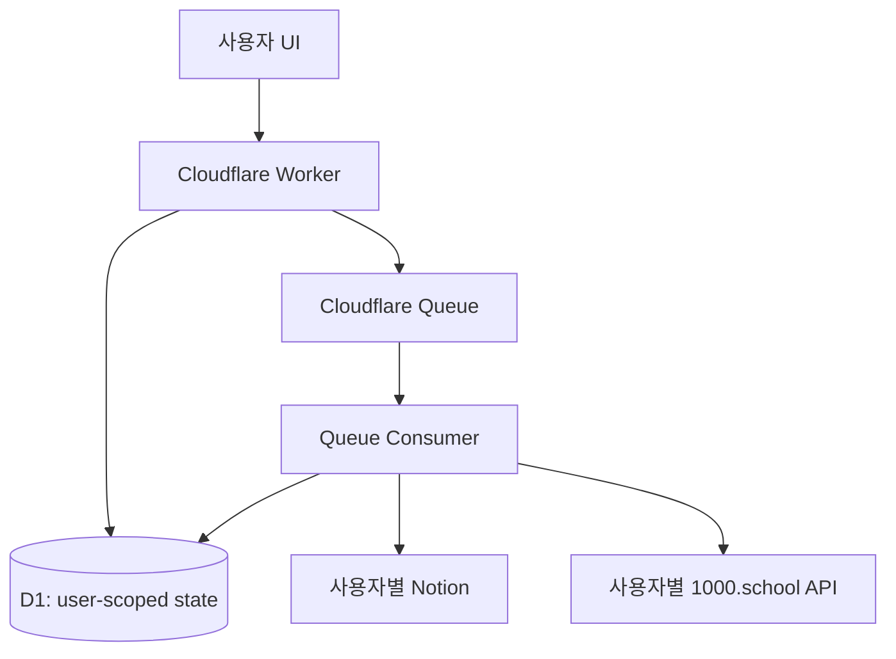

# ASPS 아키텍처

## 결정

MVP의 격리 단위는 `userId` 하나다. 팀, workspace, membership은 만들지 않는다.



## 런타임 경계

- `src/index.ts`: HTTP 진입점과 라우팅만 담당한다.
- `src/routes/`: 입력 검증과 응답 변환만 담당한다.
- `src/auth/`: 세션에서 내부 `userId`를 확정한다.
- `src/tenancy/`: 모든 repository 호출에 `userId`를 강제한다.
- `src/repositories/`: D1 접근만 담당한다. 단건 조회도 `user_id`를 조건으로 사용한다.
- `src/security/`: credential 암호화, 서명 검증, 민감정보 masking을 담당한다.
- `src/services/notion/`: Notion 응답을 내부 type으로 변환한다.
- `src/services/thousand-school/`: 공식 API 계약을 내부 adapter로 감싼다. 계약 확정 전 endpoint는 작성하지 않는다.
- `src/workflows/`: Queue consumer에서 단계 순서와 재시작을 담당한다.
- `src/types/`: Worker 환경과 외부/내부 DTO를 정의한다.
- `migrations/`: D1 schema와 사용자 소유권을 보장하는 composite foreign key를 관리한다.

인증은 Cloudflare Access JWT의 `Cf-Access-Jwt-Assertion`을 사용한다. JWT의 불변 `sub`를 `users.auth_subject`에 mapping한 뒤 모든 사용자 API에 주입한다.

현재 구현된 사용자 API는 `/api/me`, `/api/me/connections/notion`, `/api/me/connections/thousand-school`, `/api/me/automation-profiles`와 profile 단건 API, `/api/jobs`와 job 단건/재시도/취소 API, `POST /api/sync/notion`이다. Notion sync는 `전송대기` page를 서버에서 변환·해시해 멱등 job을 Queue에 넣는다. 외부 API 계약이 확인되기 전에는 실제 1000.school 쓰기 workflow를 추가하지 않는다.

현재 연결 API는 provider별 활성 연결 하나를 관리한다. 다중 Notion/1000.school 계정 선택이 실제 요구사항이 되면 목록/선택 API로 확장한다.

## 핵심 흐름

1. 요청 인증에서 `userId`를 결정한다. client가 보낸 `userId`는 사용하지 않는다.
2. profile, connection, account, job의 소유자를 같은 transaction/query에서 확인한다.
3. Queue에는 `userId`, `profileId`, `jobId` 같은 불투명 ID만 넣는다.
4. consumer가 외부 호출 직전에 사용자와 credential 상태를 다시 확인한다.
5. Queue consumer가 Notion page와 child block을 조회하고 `content_hash`를 재검증한다.
6. 현재는 검증 성공 시 job을 `FETCHED`로 전이한다. 이후 1000.school 계약이 확정되면 작성 → AI 제안 → AI 채점 → 저장 단계를 붙인다.
7. 성공한 단계와 `content_hash`를 D1에 기록하고, 마지막에 같은 사용자의 Notion만 갱신한다.

Queue는 at-least-once이므로 `jobs`의 unique idempotency key와 조건부 상태 전이를 함께 사용한다. KV는 권한 원장이나 lock으로 사용하지 않는다. 초기에는 D1 조건부 전이로 시작하고, 실제 contention이 확인될 때만 Durable Object를 추가한다.

## 데이터 격리

`migrations/0001_initial.sql`은 다음 링크를 composite foreign key로 묶는다.

`user → credential → connection/account → profile → job → job_step`

따라서 profile이 다른 사용자의 connection을 가리키는 조합을 DB 레벨에서도 거부한다. 애플리케이션 query도 항상 `WHERE user_id = ?`를 포함해야 한다.

Credential은 평문이 아니라 `key_version`, `iv`, `encrypted_payload`로 저장한다. master key는 D1에 저장하지 않고 Cloudflare Secret에 둔다. queue payload, log, response에는 token/cookie/content 원문을 넣지 않는다.

`CREDENTIAL_ENCRYPTION_KEY`는 base64로 인코딩한 AES 키이며, Web Crypto AES-GCM 결과의 authentication tag는 `encrypted_payload`에 포함된다. API 응답에는 credential 원문이나 `auth_subject`를 반환하지 않는다.

Notion adapter는 `Notion-Version: 2026-03-11`을 사용하고 data source query와 block children cursor pagination을 처리한다. connection에는 database container ID와 query 대상 `data_source_id`를 별도로 저장한다.

## 상태

```text
PENDING → FETCHED → DRAFT_CREATED → AI_SUGGESTED → AI_SCORED → SAVED
              └→ FAILED_RETRYABLE
              └→ FAILED_FINAL
              └→ AUTH_REQUIRED
              └→ CANCELLED
```

`SUGGEST`, `SCORE`, `SAVE`, `FULL_AUTO`는 앞 단계의 성공과 현재 `content_hash`를 확인한 뒤에만 다음 단계로 이동한다. timeout으로 외부 효과가 불명확하면 조회로 확인하고, 확인 방법이 없으면 `FAILED_FINAL`로 둔다.

## 외부 계약 경계

`openapi.json`에서 확인된 endpoint만 `src/services/thousand-school/client.ts`에 구현한다.

- `GET /auth/me`
- `GET|POST /auth/tokens`, `DELETE /auth/tokens/{token_id}`
- `GET|POST /daily-snippets`
- `GET|PUT|DELETE /daily-snippets/{snippet_id}`
- `POST /daily-snippets/organize`
- `GET /daily-snippets/feedback`
- `GET /daily-snippets/page-data`

응답은 `zod` schema로 검증한다. `listDailySnippets`는 `scope=own`을 고정해 다른 사용자의 데이터를 조회하지 않는다.

OpenAPI에는 `securitySchemes`가 선언되어 있지 않으므로 client는 인증 header를 자체 추측하지 않는다. 호출자는 공식 인증 확인 결과에 따라 사용자별 header를 client instance에 주입해야 한다.

실제 adapter를 추가할 때 필요한 최소 계약은 다음이다.

- 초안 작성/수정
- AI 제안
- AI 채점
- 저장
- timeout 뒤 성공 여부를 확인할 조회 방법
- 401/403/429/5xx의 재시도·상태 변환 규칙

현재 OpenAPI에는 별도 AI 채점 endpoint나 최종 저장 전용 endpoint가 없다. `organize`를 AI 제안/채점으로 임의 매핑하지 않았으며, 이 두 workflow 단계는 실제 계약이 추가로 확인될 때 구현한다.

## 구현 순서

1. 인증과 `users` repository
2. credential 암호화와 user-scoped connection/profile repository
3. Notion block 변환과 content hash
4. job 상태 전이와 Queue consumer
5. 공식 계약 기반 1000.school adapter
6. 사용자 UI와 두 사용자 교차 접근 E2E

현재 저장소는 Worker API, Notion sync/Queue 기반 `FETCHED` 단계까지 포함한다. 실제 1000.school 저장 기능은 공식 계약과 출시 차단 조건이 통과된 뒤 별도로 활성화한다.
